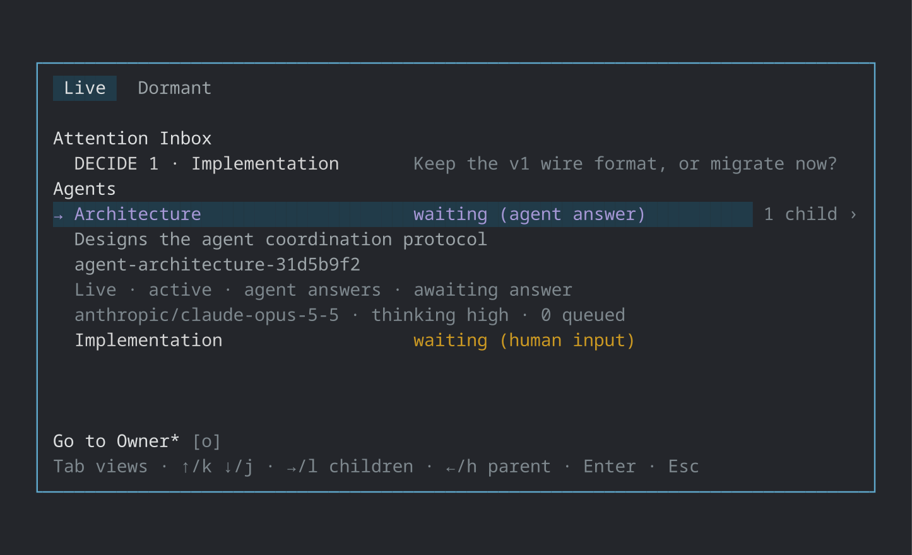

# pi-durable-subagents

Durable Pi agents that collaborate asynchronously under explicit Owner and Spawner supervision.

## Features

### Interactive Agent switching

Run `/agents` from the Owner or any Agent to open the Agent switcher. Use `/agents owner` to return directly to the exact mounted Workflow Owner presentation without opening the switcher:



Select a subagent to enter its complete Pi session and interact with it directly—read its transcript, type into its editor, or use its commands and tools. In fullscreen mode, a primary click on the activity dock above the editor opens the same switcher.

### Coordination and supervision

- **Owner-directed Workflows:** the current Pi session, in the TUI or a headless mode, becomes the durable Workflow Owner. Fork or clone it into a fresh, independent Workflow. See [Owner Workflow](docs/owner-workflow.md).
- **Durable child Agents:** Agents create configurable, context-isolated children with `agent_spawn`. See [Agent spawning](docs/agent-spawning.md).
- **Messaging and Requests:** `agent_message` sends Messages and titled Requests; `agent_wait` joins their Answers. See [Agent messaging](docs/agent-messaging.md).
- **Visible obligations:** `agent_observe` lists and retrieves your outstanding Requests.
- **Human decisions:** in the TUI, a spawned Agent can block on one free-form Human Answer with `ask_user`. See [Human Requests](docs/human-requests.md).
- **Run supervision:** Owners and Direct Spawners inspect, interrupt, resume, or abort exact Runs with `agent_observe` and `agent_control`. See [Run supervision](docs/run-supervision.md).
- **Incident handling:** a runtime reminder recovers forgotten Answers; isolated Moderators handle persistent stalls, deadlocks, and failures under policy bounds. See [Operational Incident moderation](docs/operational-incident-moderation.md).
- **Durable recovery:** a fresh host rebuilds authority and pending Requests from Pi transcripts. See [Cold host recovery](docs/cold-host-recovery.md).
- **Model policy:** `/agents models` maintains a durable deny list of models children may not use. See [Workflow Policy](docs/workflow-policy.md).

Coordination does not override Pi's compaction, retry, or transport settings.

### Obligations outlive Runs


A Request creates an Answer obligation that the responder owes until it commits an Answer or receives the requester's Cancellation. Stopping, resuming, or failing the Run, or a human typing into the child, leaves it open, and a plain Message creates none. When an obligated Agent stalls, the host sends one reminder (plus a free one if it stalled while a human was typing into it), then starts a Moderator that can intervene or escalate to the Workflow Owner. See [Agent messaging](docs/agent-messaging.md) and [Operational Incident moderation](docs/operational-incident-moderation.md).

## Installation

Install from npm:

```bash
pi install npm:pi-durable-subagents
```

Or track the Git repository directly:

```bash
pi install git:github.com/xian0x5a/pi-durable-subagents
```

Attached-terminal support uses the `node-pty` native addon. It ships prebuilt binaries for Linux, macOS, and Windows on x64 and arm64, so those platforms need no install-time build. Other platforms compile it from source, which needs a C++ toolchain and npm permission to run its install scripts.

## Usage

Start an interactive Pi TUI:

```bash
pi
```

The package adopts the current session as the Workflow Owner; no separate activation command is required.

Headless modes host the Owner too, with no human in the loop:

```bash
pi -p "Delegate the review to two agents and summarize their answers"
pi --mode json "..."
pi --mode rpc
```

In a headless Workflow, Agents cannot use `ask_user`; they escalate through their supervisor instead. When a child's Run suspends, its supervisor is notified. The Agents selector, Agent views, and activity dock need the TUI. Reports are stored in the session, so reopen it interactively (`pi --session <file>`) to read them. See [Headless Workflows](docs/owner-workflow.md#headless-workflows).

## Suggested agent templates

Templates are creation presets: edits apply to future spawns only. See [Agent Templates](docs/agent-spawning.md#agent-templates) for configuration details.

### `cheap-delegate`

A cost-efficient default for bounded implementation, routine execution, and targeted fact-finding.

Save as `~/.agents/agents/cheap-delegate.md`:

```markdown
---
name: cheap-delegate
useWhen: >-
  Use as a cost-efficient default delegate for tasks with clear goals and
  verifiable outcomes, such as implementation with explicit requirements or
  instructions and bounded scope, routine execution, or targeted fact-finding.
  Do not use for thorough review, open-ended investigation, high-stakes security
  or architecture work, or tasks requiring substantial ambiguity resolution.
  If its results remain inadequate after several iterations and show no obvious
  improvement, stop assigning that task to this template.
models:
  - id: openai-codex/gpt-5.6-luna
    thinking: high
---
```

### `moderator`

Used automatically for incident handling; point it at a cheaper model.

Save as `~/.agents/agents/moderator.md`:

```markdown
---
name: moderator
useWhen: Use for moderation and incident response.
models:
  - id: openai-codex/gpt-5.6-luna
    thinking: high
  - id: deepseek/deepseek-v4-flash
    thinking: high
---
```

## Compatibility

Pi supplies the package's Pi peer modules; compatibility is checked structurally against the running host, not by Pi version. See [Development](docs/development.md) for the conformance gate and supervised test runs.

## Trust and persistence

Coordination is a trust-based protocol, not a security boundary. Owners, Spawners, ordinary Agents, and Moderators are trusted participants acting through role-scoped tools.

Pi transcripts are the durable authority for identity, Messages, Requests, Deliveries, and committed results. Scheduling queues, Holds, live Run state, UI attention, and open Agent-view attachment are volatile: orderly shutdown closes them, while abrupt process loss can discard them without claiming durable completion.

## Documentation

- [Owner Workflow](docs/owner-workflow.md) — activation, headless Workflows, and compatibility behavior
- [Owner blockage diagnostics](docs/owner-blockage-diagnostics.md) — persistent admission failure status and `/agents diagnostics`
- [Transcript repair design](docs/workflow-transcript-repair-design.md) — proposed Workflow-owned repair Moderator and validated replacement; not implemented
- [Operational Incident moderation](docs/operational-incident-moderation.md) — trigger detection, bounded handling, Moderator authority, Resolution, and recovery
- [Cold host recovery](docs/cold-host-recovery.md) — transcript discovery, quarantine, dormant rosters, and residual Requests
- [Workflow Policy](docs/workflow-policy.md) — reloadable execution, delivery, review limits, and the `/agents models` exclusion list
- [Agent spawning](docs/agent-spawning.md) — child creation and receipt semantics
- [Agent messaging](docs/agent-messaging.md) — delivery modes and Agent Requests
- [Human Requests](docs/human-requests.md) — transcript-native questions, Answer mode, and commitment
- [Agent selector](docs/agent-selector.md) — Live hierarchy, Dormant recency, attention, and keyboard navigation
- [Interactive Agent view acceptance](docs/agent-view-acceptance.md) — complete-mode rendering, input, transitions, isolation, and lifecycle evidence
- [Run supervision](docs/run-supervision.md) — observation, interruption, resumption, abort, and Agent-view retention
- [Development](docs/development.md) — compatibility gate, supervised test runs, and deadlines
